# GB Electricity Market Intraday Trading Analysis

The GB electricity market, known for its liberalized and competitive environment, enables trading of electricity between generators, suppliers, and other market participants. Our focus is the intraday spot market, where prices can fluctuate significantly within the day. By analyzing these fluctuations from October 1, 2024 to December 31, 2024, our goal is to devise a trading strategy that leverages observed volatility patterns.

The intraday spot market operates on a short-term basis (same-day or next-day delivery). Prices in this market are particularly volatile due to factors such as demand/supply dynamics, availability of wind and solar generation, and unforeseen outages.

---

## 1. Regime Identification

We employ three complementary methods to classify market regimes:

1. **Average True Range (ATR)**  
   ATR measures market volatility by averaging the True Range over a specified period.  
   - **True Range** is the greatest of:  
     - Current high minus current low  
     - \|Current high minus previous close\|  
     - \|Current low minus previous close\|  

   ATR captures the full magnitude of price movements, which is crucial for sizing trades and managing risk.

   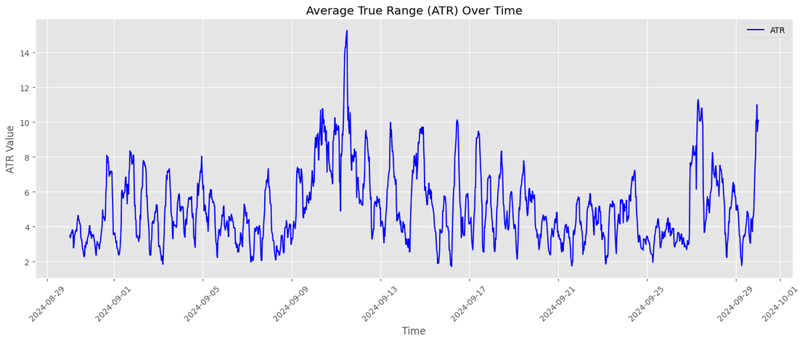

2. **Cumulative Sum (CUSUM)**  
   CUSUM is a sequential analysis technique that accumulates positive and negative deviations from a target mean, allowing detection of subtle shifts in price behavior.

   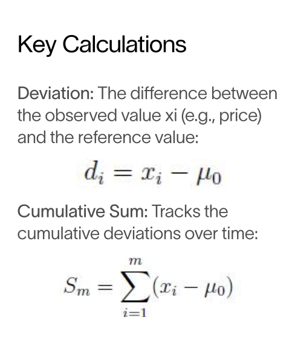  
   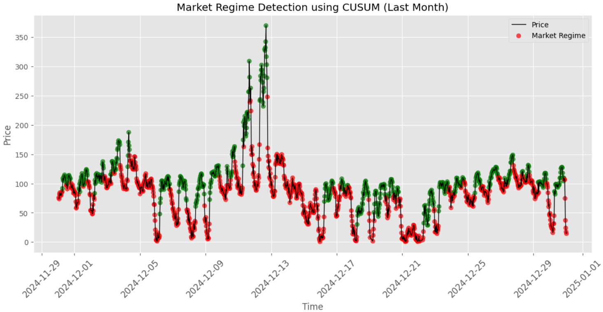

3. **Time‑Based Classification**  
   Intraday demand varies predictably:
   - **Evening (15:00–18:00)**: Higher residential demand ⇒ potential bullish runs  
   - **Early morning (01:00–04:00)**: Lower demand ⇒ potential bearish runs

   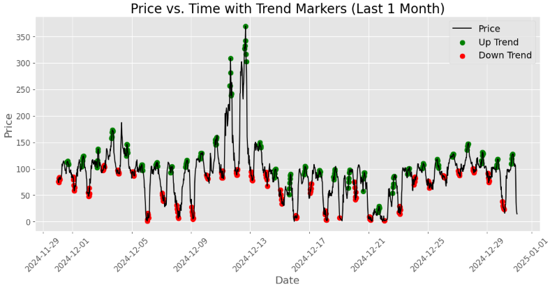

---

## 2. Trend Identification

To capture significant price movements, we use:

- **Bollinger Bands**  
  - Upper Band: SMA + 2 × STD  
  - Middle Band: SMA  
  - Lower Band: SMA − 2 × STD  

  Prices moving outside the bands often signal mean reversion opportunities.

- **Zig‑Zag Indicator**  
  Filters out minor fluctuations to highlight major swing highs and lows, clarifying trend direction.

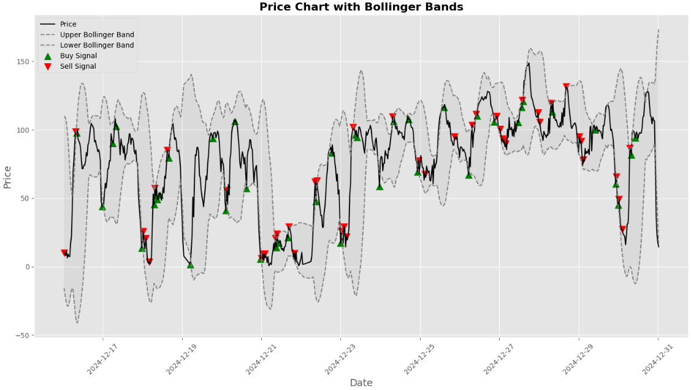

---

## 3. Trading Strategy Formulation

Our strategy integrates regime classification with trend signals to optimize trade timing and size.

### 3.1 Signal Generation

- Execute trades when trend signals (Bollinger & Zig‑Zag) coincide with the current regime identified by CUSUM.

### 3.2 Capital Allocation

- **Bullish regime (hourly based)**: Allocate 10% of capital per trade.  
- **Other regimes**: Allocate 5% of capital per trade.

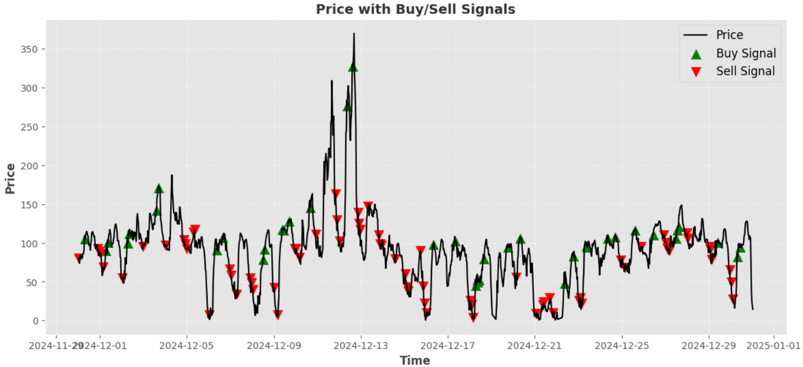

---

## 4. Risk Management

Given high market volatility, we apply:

- **Value at Risk (VaR)** at 95% confidence to set loss thresholds.  
- **Stop‑Loss**: Exit position if loss exceeds 2%.  
- **Profit Taking**: When profit ≥ 5%, close 60% of the position and trail the stop‑loss on the remaining exposure.

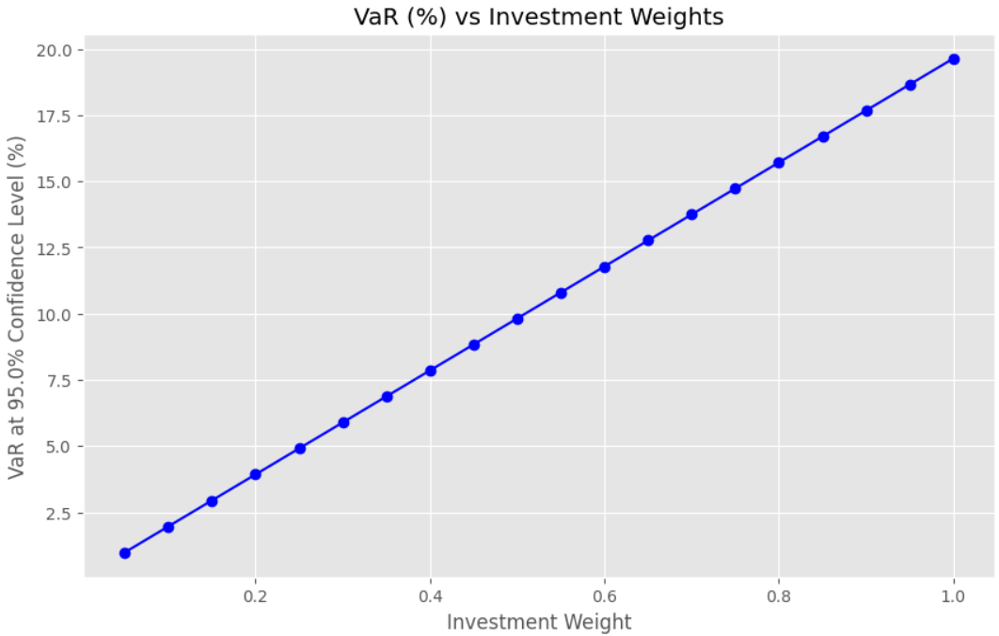

---

## 5. Performance Metrics & Results

- **Sharpe Ratio**: 9.24  
- **Sortino Ratio**: 5.26  
- **Annualized Volatility**: 54.02%  
- **Maximum Drawdown**: −7.25%  
- **Total Return**: 327.42% (Oct–Dec 2024)

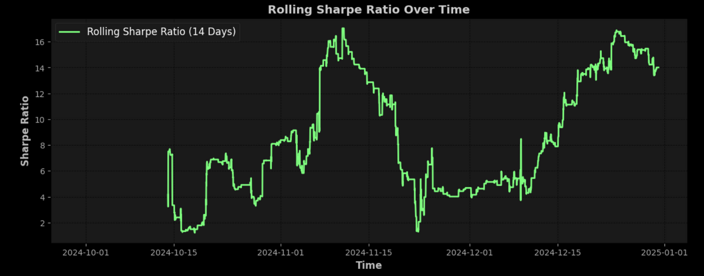  
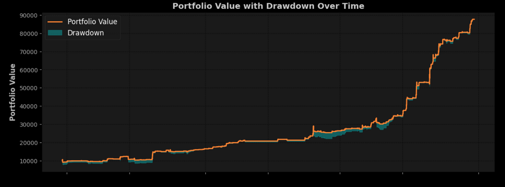

---

## 6. Statistical Validation

- **T‑test**: Statistic = 3.86, P‑value = 0.00012 (significant at 0.05)  
- **Mean Return**: 0.00132 (95% CI: [0.00063, 0.00197])  
- **Win Rate**: 40.90%  
- **Profit Factor**: 1.94  

Total profit (2.10) exceeds total loss (1.08), confirming overall profitability.

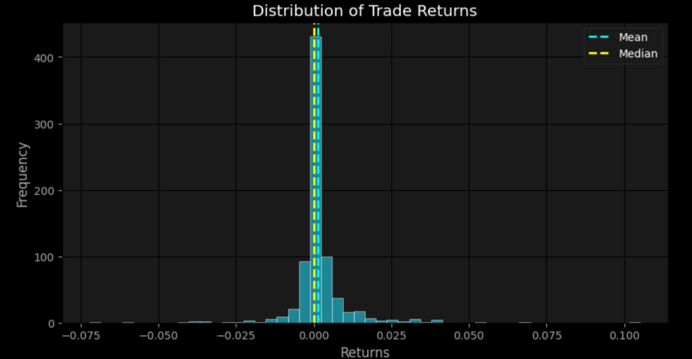

---

## 7. Robustness Testing

To avoid lookahead bias, we used a **data‑cutting** method:
- Split historical data into multiple segments.
- Validate that signal performance remains consistent across each segment.

**Plot of Before vs. After Signal**

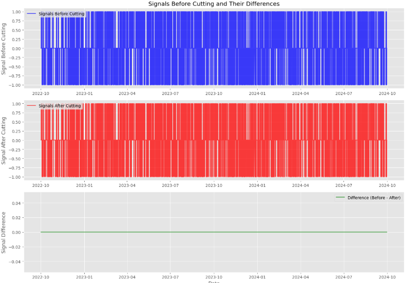

